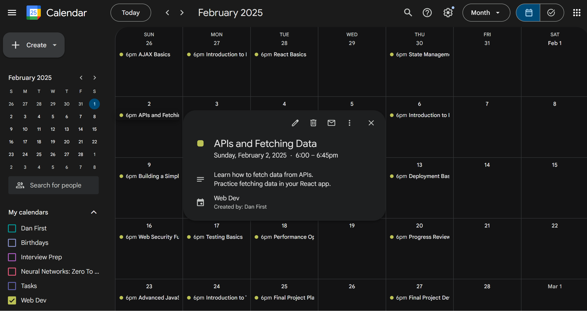

# Learning Calendar Generator

The **Learning Calendar Generator** is a Python-based application that helps you create a personalized learning schedule for any subject of your choosing. It uses OpenAI's API to generate tasks and saves them into a study calendar in `.ics` format, which can be imported into your favorite calendar app.

## Example Calendar

Here is an example of a generated learning calendar:



## Features
- Define your **subject** and optional **guiding resources** (e.g., links to tutorials or articles).
- Specify your **learning schedule**, including:
  - Start and end dates.
  - Days of the week available for study.
  - Daily start time and study duration.
- Optionally exclude holidays from your schedule.
- Automatically generate a structured learning plan using OpenAI's API.
- Export the plan as an `.ics` file for easy calendar integration.

## Prerequisites
1. Python 3.7 or later.
2. The following Python libraries:
   - `openai`
   - `python-dotenv`
   - `ics`
   - `pytz`
   - `holidays`
3. An OpenAI API key (store it in a `.env` file).

## Installation
1. Clone this repository:
   ```bash
   git clone https://github.com/danfirsten/AcademiCal.git
   ```
2.  Install the required Python packages:
    
    ```bash
    pip install -r requirements.txt` 
    ```
    
3.  Create a `.env` file in the project root and add your OpenAI API key:
    
    ```makefile
    OPENAI_API_KEY=your_openai_api_key_here` 
    ```
    

## Usage

1.  Run the program:
    
    ```bash
    python learning_calendar.py
    ``` 
    
2.  Follow the prompts to:
    
    -   Enter the subject you want to learn.
    -   Provide an optional link to guiding resources.
    -   Specify the start and end dates for your learning schedule.
    -   Choose the days of the week you are available for study.
    -   Indicate if you want to exclude holidays from your schedule.
    -   Set your daily start time and study duration.
3.  After completing the prompts, the program will:
    
    -   Generate a list of tasks for your learning schedule.
    -   Create a `.ics` calendar file with events corresponding to the tasks.
4.  Import the generated `.ics` file into your calendar application.

-  **Google Calendar**:

	- Go to `Settings > Add Calendar > Create New Calendar`

	- Name the new calendar ( e.g. 'Web Dev')

	- Go to `Settings > Import & Export > Import`.

	- Make sure your new calendar is selected

	- Upload the `.ics` file.

-  **Outlook**:

	- Go to `File > Open & Export > Import/Export`.

	- Select the `.ics` file to import.

    

## File Output

The program saves the generated calendar in the `calendars` folder  as:

```php
<subject_name>_Learning_Calendar.ics
```

Replace `<subject_name>` with the name of the subject you specified.

## Example Workflow

**Input:**

-   Subject: "Python Programming"
-   Start Date: "2024-01-01"
-   End Date: "2024-02-01"
-   Active Days: Monday, Wednesday, Friday
-   Daily Start Time: "10:00"
-   Study Duration: "02:30"

**Output:**

-   A structured learning plan generated using OpenAI.
-   A calendar file named `calendars/Python_Programming_Learning_Calendar.ics`.

## Dependencies

The following libraries are used in this project:

-   **[OpenAI](https://pypi.org/project/openai/):** To interact with OpenAI's API for task generation.
-   **[python-dotenv](https://pypi.org/project/python-dotenv/):** To manage environment variables securely.
-   **[ics](https://pypi.org/project/ics/):** For creating and exporting calendar events.
-   **[holidays](https://pypi.org/project/holidays/):** To account for national holidays.
-   **[pytz](https://pypi.org/project/pytz/):** For handling timezones.

## License

This project is licensed under the MIT License.